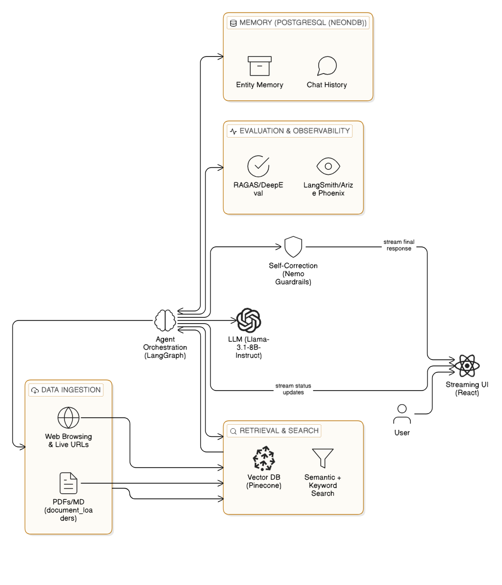

```bash

.
├── backend/
│   ├── app.py                # Orchestration & API
│   ├── ingestion.py          # Logic for PDFs/Markdown (Unstructured.io/PyMuPDF)
│   ├── requirements.txt
│   ├── .env
│   ├── db_config.py
│   ├── data/
│   │   └── PDFs, DOCX, TXT
│   └── config/
│       └── config.co
│       └── config.yml
│       └── prompts.yml
│
├── frontend/                 # Streaming UI (React)
│   ├── src/
│   │   ├── components/
│   │   │   └── ChatWindow.js # Logic for handling SSE (StreamingResponse)
│   │   └── App.js
│   ├── package.json
│   └── public/
│
├── scripts/
    └── init_db.sql           # PostgreSQL schema for entity memory/chat history

```
